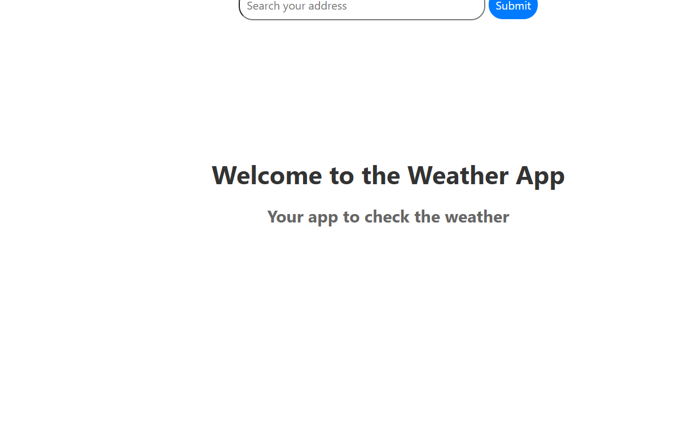

# 🌦️ Weather App

A modern and responsive Weather App built with HTML, CSS, and JavaScript.  
This project allows users to search for real-time weather information for any city using a weather API.

The main goal of this project was to practice API integration, asynchronous JavaScript, DOM manipulation, and responsive UI design.

---

## 🚀 Live Demo

👉 https://gparej0.github.io/WeatherApp/

---

## 📸 Preview



---

## ✨ Features

- Search weather by city name
- Real-time weather information
- Displays:
  - Temperature
  - Weather conditions
  - Humidity
  - Wind speed
- Dynamic weather icons
- Error handling for invalid city names
- Responsive design for desktop and mobile devices
- Clean and modern user interface

---

## 🛠️ Technologies Used

- HTML5
- CSS3
- JavaScript (Vanilla JS)
- Weather API

---

## 📂 Project Structure

```bash
📦 WeatherApp
 ┣ 📂 src
 ┃ ┗ 📜 index.js
 ┣ 📜 .gitignore
 ┣ 📜 package-lock.json
 ┣ 📜 package.json
 ┣ 📜 webpack.config.js
 ┗ 📜 README.md

```

---

## 📚 What I Learned

With this project I practiced:

Working with APIs and fetching data
Handling asynchronous JavaScript with async/await
DOM manipulation and dynamic rendering
Error handling in JavaScript
Responsive web design principles
Organizing frontend project structure
Improving user experience with interactive interfaces

---

## ⚙️ Installation

Clone the repository:
```bash
git clone https://github.com/GParej0/WeatherApp.git
```

Open the project folder:
```bash
cd WeatherApp
```

Finally, open index.html in your browser.

---

## 🔑 API Configuration

This project uses a weather API to retrieve real-time data.

To use your own API key:

Create an account on your preferred weather API provider
Generate an API key
Replace the API key inside the JavaScript file

Example:
```JavaScript
const apiKey = "YOUR_API_KEY";
```

---

## 🎯 Future Improvements
Add 5-day weather forecast
Detect user geolocation automatically
Add dark/light mode
Improve animations and transitions

---

## 👨‍💻 Author
GitHub: @GParej0
